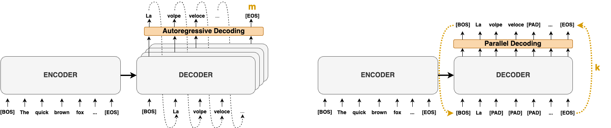
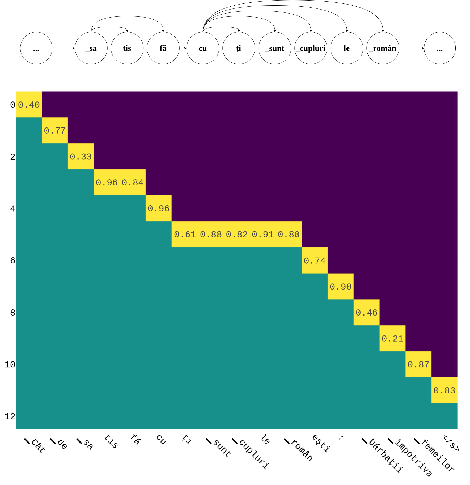

<div align="center">    
 
# Accelerating Transformer Inference for Translation via Parallel Decoding

[](https://arxiv.org/abs/2305.10427)
[]()

</div>


This is the code repository of the paper "Accelerating Transformer Inference for Translation via Parallel Decoding" accepted at ACL 2023 main conference.

The paper proposes three Parallel Decoding methods to speedup existing autoregressive machine translation models.

This code is not production ready and should be used just for research purposes.

**Paper**: https://arxiv.org/abs/2305.10427

<div align="center">

</div>


## Reproduce the results
To produce the benchmark values for en-ro Wmt16, do:
1. install all the requirements with `pip install -r requirements.txt`
2. run the following to retrieve the benchmark values:
    ```
    python3 main.py src_lang="en" tgt_lang="ro" device="cpu" dataset.name="wmt" dataset.version="16" task="benchmark" bench.result_dir="[your path]" model.model_name="Helsinki-NLP/opus-mt-en-ro"
    ```
Iters speedup and BLEU results should be easy to reproduce. Time speedups depend on the availability of the underlying hardware and software to run computation in parallel without introducing overheads. Please follow the experimental setting proposed in the paper. The easiest way is to use a virgin virtual machine, we provide the instruction in the Scaling Experiments in this readme.

## Datasets
All the dataset are available via `HuggingFace` datasets, so they will be downloaded automatically.
However, `Iwslt` needs to be downloaded manually. In particular, you have to download `2015-01/texts` for `Iwslt15` and `
2017-01-trnted/texts` for `Iwslt17`. Once downloaded, you should specify the path as parameter in the python command, by adding `dataset.data_dir=[your path]` (it is possible also to modify it manually in `conf/config.yaml`).

## Table 1 and Table 5 Experiments - Parallel Decoding Algorithms
To reproduce results in Table 1 run the command.
```
    /bin/bash ./exp/tab1.sh
```
Please modify beforehand the result_dir path in `tab1.sh` or in the config file `conf/config.yaml`.

## Table 2 and Table 6 Experiments - Cross Languages
To reproduce results in Table 2 run the command.
```
    /bin/bash ./exp/tab2.sh
```
Please modify beforehand the result_dir path in  `tab2.sh` or in the config file `conf/config.yaml`.

## Figure 3 and Figure 5 - Scaling Experiments
To reproduce the scaling experiments you need to use Google Clouds with `c2d-standard-XX`, where XX is the number of used cores. Then you need to run the command as specified in section "Reproduce Results" of this README.
To ease the process we provide the command to launch the virtual machine using gcloud-cli.

```
gcloud compute instances create instance-1 --zone=us-central1-a --machine-type=c2d-standard-8 --network-interface=network-tier=PREMIUM,subnet=default --maintenance-policy=MIGRATE --provisioning-model=STANDARD --scopes=https://www.googleapis.com/auth/devstorage.read_only,https://www.googleapis.com/auth/logging.write,https://www.googleapis.com/auth/monitoring.write,https://www.googleapis.com/auth/servicecontrol,https://www.googleapis.com/auth/service.management.readonly,https://www.googleapis.com/auth/trace.append --create-disk=boot=yes,device-name=instance-1,image=projects/ubuntu-os-cloud/global/images/ubuntu-2004-focal-v20221015,mode=rw,size=30 --no-shielded-secure-boot --shielded-vtpm --shielded-integrity-monitoring --reservation-affinity=any
```
## Table 3 Experiments - FLOPs calculator

To reproduce the FLOPs calculation in Table 3 simply run the script:
```
    python3 ./exp/flops_calculator.py 
```

## Dependency Graph Visualizer (DDGviz)

To run the Dependency Graph Visualizer (DDGviz) execute the command:
```
    PYTHONPATH=. python3 ./src/viz/visualize.py
```
It is possible to select the examples to visualize with the param `--examples [list of id in the dataset]`. The dataset and source/target language can be selected with the corresponding commands, please use the param `--help` for more info.
The output DDGviz visualization will be saved in `iteration_matrix/<dataset_hash>/images`.

<div align="center">

</div>


## Citation

If you use this code please cite:

```bibtex
@inproceedings{santilli-etal-2023-accelerating,
    title = "Accelerating Transformer Inference for Translation via Parallel Decoding",
    author = "Santilli, Andrea  and
      Severino, Silvio  and
      Postolache, Emilian  and
      Maiorca, Valentino  and
      Mancusi, Michele  and
      Marin, Riccardo  and
      Rodola, Emanuele",
    booktitle = "Proceedings of the 61st Annual Meeting of the Association for Computational Linguistics (Volume 1: Long Papers)",
    month = jul,
    year = "2023",
    address = "Toronto, Canada",
    publisher = "Association for Computational Linguistics",
    url = "https://aclanthology.org/2023.acl-long.689",
    pages = "12336--12355",
    abstract = "Autoregressive decoding limits the efficiency of transformers for Machine Translation (MT). The community proposed specific network architectures and learning-based methods to solve this issue, which are expensive and require changes to the MT model, trading inference speed at the cost of the translation quality. In this paper, we propose to address the problem from the point of view of decoding algorithms, as a less explored but rather compelling direction. We propose to reframe the standard greedy autoregressive decoding of MT with a parallel formulation leveraging Jacobi and Gauss-Seidel fixed-point iteration methods for fast inference.This formulation allows to speed up existing models without training or modifications while retaining translation quality. We present three parallel decoding algorithms and test them on different languages and models showing how the parallelization introduces a speedup up to 38{\%} w.r.t. the standard autoregressive decoding and nearly 2x when scaling the method on parallel resources. Finally, we introduce a decoding dependency graph visualizer (DDGviz) that let us see how the model has learned the conditional dependence between tokens and inspect the decoding procedure.",
}
```
